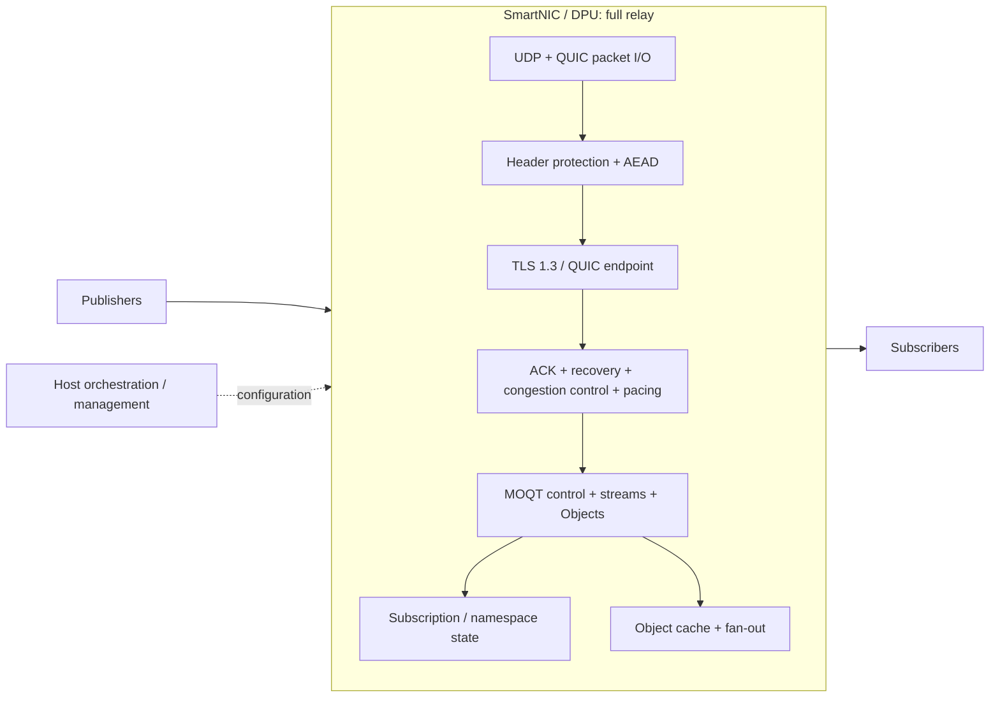
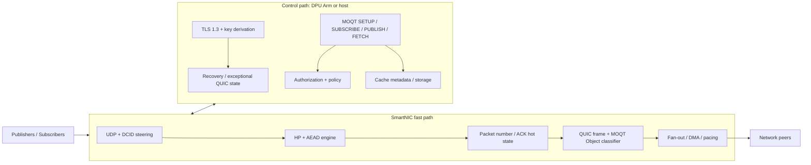
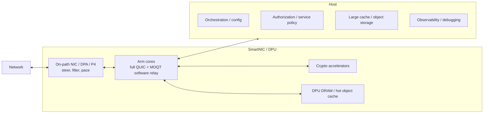
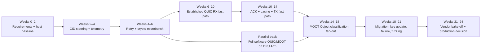

# Media-over-QUIC Relay Offload to SmartNICs: Feasibility, Architecture, and Validation Plan

## Executive summary

**Conclusion: a Media-over-QUIC Transport relay can be offloaded to a SmartNIC/DPU, but the technically and operationally sound design is usually a hybrid rather than a complete line-rate hardware implementation.** The key distinction is between a QUIC-aware packet forwarder and a true MOQT relay. A device that merely routes UDP/QUIC packets by five-tuple or Destination Connection ID can be almost entirely offloaded to a P4, eBPF/XDP, FPGA, or NIC flow pipeline. A true MOQT relay, however, is a QUIC endpoint on each hop: it terminates hop-by-hop QUIC security, maintains independent transport state toward publishers and subscribers, parses MOQT requests and Object headers, manages subscriptions and namespaces, and may cache or replicate Objects. The current MOQT specification explicitly treats relays as first-class, stateful protocol participants rather than transparent routers. citeturn14view0turn15view0turn18view1

That difference matters because QUIC deliberately encrypts nearly everything needed to implement transport semantics. QUIC uses TLS 1.3 for handshake/key establishment, but **does not use the TLS record layer**; CRYPTO messages are carried directly inside QUIC and QUIC itself protects packets. Consequently, conventional NIC TLS/kTLS record offload cannot simply be reused as “QUIC offload.” A useful accelerator must expose QUIC-aware packet protection or sufficiently generic AES-GCM/ChaCha20, AES-ECB/ChaCha20 header-protection, HKDF/key-management, packet-number, queueing, and timer primitives. citeturn14view2turn15view6turn15view7

The most attractive split is therefore:

**SmartNIC fast path:** UDP classification; QUIC Connection-ID steering; anti-DoS/Retry processing; address-validation tokens; hardware AEAD/header protection where available; packet-number bookkeeping; established-flow lookup; portions of ACK generation; packet scheduling/pacing; object/stream classification after decryption; fan-out/copy operations; telemetry; and possibly stateless reset generation.

**General-purpose control path on DPU Arm cores or host:** TLS 1.3 state machine and certificate handling; 0-RTT admission policy; key lifecycle coordination; exceptional QUIC state transitions; sophisticated congestion control; MOQT SETUP and request processing; publisher/subscriber authorization; namespace/subscription graphs; cache policy; graceful session migration; extensions; configuration; and error handling.

This split is not merely theoretical. The August 2026 *TurboRetry* work demonstrates a closely related QUIC split on NVIDIA BlueField-3: stateless Retry/token work is offloaded to the DPU, an on-path DPA caches authorized Connection IDs, and the host retains stateful QUIC connection management. Its BlueField-3 AES-GCM measurements report about **4 million operations/s from one DPU Arm core invoking the accelerator with under 2 μs latency**, and the complete defense sustained a 3-Mpps handshake flood while adding roughly 0.2 ms to ordinary connection setup. Importantly, its authors found that sending operations through the off-path Arm/accelerator path adds PCIe-switch traversal latency and therefore kept simple connection authorization on the on-path DPA. That is almost exactly the architectural lesson applicable to an MOQT relay. citeturn20view0turn20view2turn20view3turn20view5

Among readily documented platforms, **NVIDIA BlueField-3 is the strongest first feasibility target** because it combines a 400-Gb/s NIC/DPU, general-purpose Arm cores, an on-path programmable DPA, DOCA/DPDK-style software facilities, and demonstrated AES-GCM/QUIC experimentation. Intel's E2100 is also credible: Intel documents 200-GbE, a rich packet-processing pipeline, Arm Neoverse N1 compute, and crypto/compression accelerators. AMD Pensando is compelling for P4-heavy designs, with current Salina/Elba/Giglio products exposing programmable packet processing and, for Elba/Giglio, dual-200-Gb/s line-rate networking. FPGA designs remain the way to obtain the most deterministic custom QUIC datapath but have the highest engineering and verification burden. citeturn14view6turn14view7turn14view8turn11search32

The recommended engineering strategy is therefore **not “port the whole MOQT server into P4.”** Instead, treat the SmartNIC as a hierarchy: fixed-function NIC engines → programmable on-path packet processor → hardware crypto → DPU general-purpose cores → host. Move work down that hierarchy only when its semantics are stable, per-packet, bounded, and demonstrably expensive. Keep draft-sensitive MOQT semantics and complex QUIC control logic higher in the hierarchy. This is especially important because, as of September 29, 2026, MOQT remains an Internet-Draft: the current `draft-ietf-moq-transport-21` is dated September 8, 2026 and is not yet an RFC. citeturn14view0

**Working assumptions.** The request does not specify target throughput, connection count, added-latency SLO, media/object distribution, fan-out, power limit, hardware budget, or threat model. For the experiment plan below I therefore use an illustrative gate of **100 Gb/s useful relay throughput, ≤50 μs p99 steady-state added processing latency, 100,000 active QUIC sessions, fan-out up to 16, and at least 10,000 new connections/s**. These are engineering targets, not claims about available products, and should be replaced with the actual service requirements before an architecture is frozen.

## Protocol and relay workload

The present MOQT draft defines a publish/subscribe protocol running directly over QUIC or over WebTransport. It deliberately uses QUIC features including streams, datagrams, priorities, and partial-reliability mechanisms, and explicitly supports intermediate relays. The current architecture expects relays to route and potentially cache content while treating the Object payload as opaque. citeturn14view0turn18view0turn18view1

### What the SmartNIC actually has to process

QUIC's stream abstraction is a set of lightweight ordered byte streams. Stream data can be received out of order and must be buffered until it can be delivered in order, while each stream and the connection are subject to flow control. STREAM-frame boundaries are not preserved through retransmission or application delivery. This makes a transport endpoint considerably more stateful than a stateless packet pipeline. citeturn17view7turn17view8

MOQT adds a second level of multiplexing. In draft-21, each endpoint creates a unidirectional **control stream** beginning with SETUP; requests such as SUBSCRIBE, PUBLISH, FETCH and namespace operations begin on bidirectional request streams; Objects use unidirectional streams or datagrams. Subgroup streams carry one or more Objects identified by Track Alias, Group ID and Subgroup ID, while a datagram can carry one complete Object. The specification even requires connection flow control to be reserved for control streams before data streams to avoid a dependency deadlock. citeturn18view3turn15view1turn18view6turn18view7

That yields a processing hierarchy roughly like:

`Ethernet/IP/UDP → QUIC packet → header protection → packet number → AEAD → QUIC frames → streams/datagrams → MOQT stream/message → Track/Group/Subgroup/Object → relay routing/cache/fanout`

The first few stages have strong fixed-function or bounded-data-plane characteristics. The later stages increasingly require dynamic state, policy, memory management, authorization, and interactions with other sessions.

### Encryption, header protection, and handshake

QUIC uses TLS 1.3 for authentication and key establishment, but packet protection belongs to QUIC itself. TLS handshake data is placed in CRYPTO frames and **TLS record protection is not used**. This is why a NIC's TCP-oriented TLS-offload block is not automatically a QUIC accelerator. citeturn15view6

QUIC also applies separate header protection. For AES suites, the algorithm samples 16 bytes of packet ciphertext and applies AES-ECB to derive the mask; ChaCha20-Poly1305 uses the raw ChaCha20 function instead. Header protection masks packet-number-related fields, so receive processing has a dependency chain: locate the sample → remove header protection → reconstruct the packet number → construct the nonce/AAD → authenticate/decrypt the payload → parse frames. citeturn15view7

Key updates complicate accelerator state. RFC 9001 expects receivers to manage current and next packet-protection keys and potentially previous keys for reordered packets. Selection between key phases interacts with packet-number reconstruction, and the RFC warns about timing behavior around key generation and selection. A SmartNIC implementation cannot therefore model “a connection has one AES key” and remain conformant. citeturn15view8

TLS handshakes are relatively infrequent per connection but computationally and logically complex because of certificates, signatures/key exchange, transport parameters, Retry/validation, session resumption and error paths. Once established, the expensive high-rate operations become packet protection, frame parsing, bookkeeping, copying and scheduling. That strongly favors hardware-assisted crypto with the TLS state machine retained on programmable cores rather than a hard-coded handshake state machine.

### ACKs, recovery, congestion control, and pacing

QUIC's recovery semantics are particularly important when deciding what belongs in hardware. Packet numbers never repeat within a packet-number space. QUIC does **not** retransmit a lost packet wholesale; information that needs reliable delivery is placed into new frames in newly numbered packets. Recovery therefore couples packet metadata, ACK ranges, RTT measurements, outstanding frame state, PTO timers, stream offsets and congestion-control accounting. citeturn14view3turn17view3

ACK generation itself is moderately offloadable: a receiver can maintain packet-number/range structures and delayed-ACK timers in a programmable accelerator. Loss recovery is harder because acknowledgement of a packet must ultimately release or reschedule the corresponding stream/control information.

RFC 9002 also recommends pacing in-flight packets based on the congestion controller and requires senders either to pace or constrain packet bursts. Its illustrative pacing rate is based on congestion window and smoothed RTT. This is a good fit for a NIC once software has calculated the desired send time/rate: timestamped transmit queues or hardware scheduling can often perform the final pacing more accurately than a host thread. The congestion controller itself is less attractive to hard-wire because the state and algorithms evolve. citeturn15view9

### Relaying is more than stream forwarding

A conforming MOQT relay is not a transparent QUIC splice. The current draft has the relay maintain upstream and downstream publication/subscription relationships; it can satisfy ranges from cache and generate new upstream SUBSCRIBE or FETCH operations based on downstream demand. It must authorize publishers and handle migration/switchover state. It is explicitly forbidden from propagating an invalid control message or Object into another Session. citeturn15view0

Relays also cannot arbitrarily repackage media: an Object's forwarding information is encoded in its header; except where explicitly allowed for properties, the relay must not modify Object fields and must treat Object payloads as opaque rather than split, combine or alter them. Properties intended for distribution are visible to relays, while metadata that should remain private belongs in the Object payload. citeturn18view5turn18view6

This is actually favorable for acceleration. Once the control plane has decided that an Object maps from an upstream subscription to a set of downstream sessions, the bulk **payload need not be semantically inspected**. A fast path can potentially parse the small Object header, look up replication destinations, and move opaque payload bytes.

A separate IETF work item, *End-to-End Secure Objects for Media over QUIC Transport*, is referenced by draft-21 and had reached `draft-ietf-moq-secure-objects-01` in July 2026. Such object-level security can reduce the degree to which a relay needs access to media content, but it does not remove hop-by-hop QUIC termination: a true relay still needs transport/session metadata to perform MOQT forwarding. citeturn14view0

### NAT, migration, and connection IDs

MOQT itself is not an ICE/STUN/TURN protocol. For the usual client-to-public-relay deployment, QUIC handles address changes and NAT rebinding through Connection IDs and path validation. QUIC Connection IDs deliberately allow packets to remain associated with a connection when IP addresses or UDP ports change; RFC 9000 specifically warns that zero-length CIDs cause problems with migration and NAT rebinding. Connection-ID-aware SmartNIC steering is therefore substantially more robust than five-tuple-only RSS. citeturn17view0

During migration, PATH_CHALLENGE/PATH_RESPONSE validates the new path, and QUIC's migration model allows endpoint IP address/port transitions while preserving a connection. Those functions can be accelerated, but a full migration decision also changes congestion/recovery/path state and is better supervised by the transport control plane. citeturn17view4turn17view5turn17view6

For genuinely peer-to-peer traversal through restrictive NATs, a separate traversal system would still be necessary; moving MOQT onto a SmartNIC does not by itself solve NAT rendezvous or hole punching.

### Where the CPU and memory go

For an established high-bandwidth relay, the likely hotspots are:

| Hotspot | Scaling variable | Why it matters for a SmartNIC |
|---|---:|---|
| Header unprotection + AEAD | packets/s and bytes/s | Serial prerequisite to frame parsing; an obvious crypto-engine candidate. citeturn15view7 |
| QUIC frame parsing | packets/s | Variable-length frames, packet coalescing and extension handling make hard-coded parsers brittle. citeturn16view0 |
| ACK/range and sent-packet metadata | packets in flight | High-BDP connections can accumulate substantial recovery state. citeturn14view3turn17view3 |
| Stream reassembly | reordering × active streams | Requires buffering until ordered byte delivery is possible. citeturn17view7 |
| MOQT object parsing | Objects/s | Much lighter than decoding media; payloads remain opaque. citeturn18view5 |
| Object fan-out/copying | bytes/s × subscribers | Potentially more important than parsing at high fan-out; favors zero-copy/ref-count/DMA designs. |
| TLS/Retry/0-RTT | connections/s | Dominates churn and attack cases rather than steady-state media throughput. citeturn14view2turn15view4 |
| Pacing/timers | packets/s × connections | Host timer/scheduler overhead becomes significant at high packet rates; hardware scheduling is attractive. citeturn15view9 |
| Host↔DPU transfers | crossings/packet | An off-path accelerator can lose its benefit if packets or metadata repeatedly traverse PCIe. citeturn20view2turn20view3 |

A historical high-rate QUIC evaluation found considerable throughput variation across QUIC implementations and substantial sub-line-rate behavior even on a 10-Gb/s testbed, reinforcing the point that software implementation, buffering, crypto and kernel/NIC interaction can dominate well before the link itself becomes the limit. citeturn12academia39

## SmartNIC capability landscape

“SmartNIC” covers very different machines. A P4-programmable packet ASIC, an FPGA NIC, a DPU with Arm cores, and an on-path RISC-V packet processor have radically different capabilities. The question should therefore be phrased not as “can a SmartNIC run QUIC?” but **which QUIC/MOQT state belongs in which execution tier?**

### Execution mechanisms

**P4** is excellent for bounded parsing, exact-match/hash tables, counters, metadata transformations, routing, policing and replication. It is particularly suitable for QUIC Connection-ID steering because the DCID remains usable for routing without application decryption. AMD's current Pensando material explicitly advertises fully P4-programmable devices. citeturn17view0turn8search0turn14view8

It is a poor natural fit for full TLS, arbitrary-length stream reassembly, large retransmission queues, complex timers or dynamically changing congestion-control code. Even where a target provides crypto externs, those externs rather than the P4 language are doing the cryptographic work.

**eBPF/XDP** is well suited to early filtering, flow/CID classification, DoS controls, statistics and dispatch. Its use for actual NIC hardware offload remains target-dependent; designs should not assume that an XDP program which works on the host will map with identical features/performance onto a particular SmartNIC. For QUIC, it is best viewed as a front-door classifier rather than the complete transport stack.

**DPDK** supplies high-rate userspace packet I/O and is useful both on host CPUs and on DPU Arm cores. It removes kernel networking overhead but is not itself a hardware transport offload. A full software QUIC/MOQT endpoint on DPU cores plus DPDK is nevertheless a valuable intermediate architecture because it gets relay work off the host without committing protocol semantics to fixed hardware. DPDK is explicitly designed as a framework/libraries for accelerated packet processing. citeturn4search2turn4search12

**FPGA** is the most flexible option for a true deterministic QUIC fast path: custom parsers, packet-number machinery, AES-GCM/header-protection blocks, ACK engines, timers, pacing and DMA can all be built. Research FPGA NICs have demonstrated hardware transport functionality at 100-Gb/s-class rates, but this comes with substantially greater implementation and formal/testing burden than a DPU software prototype. citeturn11search32

**DPU general-purpose cores** are the safety valve. They can run ordinary C/C++/Rust transport/application logic and absorb protocol churn. Their problem is throughput per core and memory/PCIe latency. The BlueField-2 characterization literature emphasizes that an off-path SmartNIC has multiple communication paths whose choice materially affects acceleration performance; simply relocating code to onboard CPUs does not guarantee a speedup. citeturn14view5turn20view6

### Platform comparison

| Platform / family | Relevant documented capabilities | Best MOQT role | Important constraint |
|---|---|---|---|
| **NVIDIA BlueField-3** | NVIDIA specifies a 400-Gb/s infrastructure compute platform with extensive programmability. Recent QUIC research describes 16 Arm Cortex-A78 cores, an on-path RISC-V DPA, DDR5 and AES-GCM hardware acceleration. DOCA and DPDK provide the main software environment. citeturn14view6turn20view2 | **Best first prototype:** CID steering on DPA, Retry/token defense, crypto experiments, DPU-side QUIC/MOQT or hybrid fast path. | Arm/crypto path can incur additional crossing latency; generic hardware crypto accessibility must be benchmarked for exact QUIC buffer sizes and queueing. citeturn20view2turn20view3 |
| **NVIDIA BlueField-4** | NVIDIA currently describes BlueField-4 as an 800-Gb/s infrastructure platform, but the mature QUIC-offload evidence examined here is for BF3. citeturn14view6 | Future production/bake-off candidate after BF3 feasibility work. | Do not extrapolate BF3 DPA/crypto software behavior without measuring the BF4 SDK/hardware generation. |
| **Intel IPU E2100** | Intel documents a rich packet-processing pipeline, **200 GbE**, Arm Neoverse N1 compute and NVMe/compression/crypto accelerators, with customer software able to execute complex packet-processing and telemetry functions. citeturn14view7 | DPU-host split or DPU-resident QUIC/MOQT endpoint with accelerator assistance. | Exact QUIC-oriented crypto/pacing APIs and developer-access model should be validated before commitment. |
| **AMD Pensando Salina / Elba / Giglio** | Salina and Elba are advertised as fully P4 programmable; AMD states dual-200-Gb/s line-rate acceleration for Elba/Giglio networking/storage/security workloads. citeturn14view8 | Excellent CID/routing/NAT/ACL/fanout front end; potentially more with vendor crypto externs. | P4 alone is not enough for complete QUIC endpoint semantics; confirm accessible crypto and general-purpose control-path APIs. |
| **AMD/Xilinx FPGA-class NIC** | Fully custom packet/crypto/timer/stream hardware is feasible; academic FPGA-NIC work demonstrates 100-Gb/s-class programmable transport acceleration. citeturn11search32 | Highest-performance custom QUIC established-flow engine after protocol design stabilizes. | Highest NRE, verification burden and upgrade friction. Exact card/Vitis toolchain should be selected only after throughput/SLO definition. |
| **Netronome Agilio** | Netronome markets Agilio as a programmable SmartNIC offload platform; it has also been a common networking research platform. citeturn14view9 | Valuable research precedent for programmable transport fast paths. | Legacy-generation choice for a 2026 deployment; more useful as architectural evidence than as the default production target. |
| **Broadcom programmable-NIC/DPU portfolio** | The public primary-source material retrieved in this research pass was not sufficiently specific to substantiate a currently supported, customer-programmable general-purpose QUIC/TLS datapath. | Include in an RFI/vendor bake-off if Broadcom is already strategic in the environment. | Require written confirmation of programmable parser, state/table capacity, generic AEAD/header protection, timer/pacer APIs, SDK access and support lifecycle before shortlisting. |

Netronome's **FlexTOE** research is especially instructive even though it is TCP rather than QUIC. FlexTOE offloaded an established transport data path to an Agilio SmartNIC while avoiding some of the most complex control-path logic in the NIC, and reported significant host-CPU and tail-latency benefits. The transferable lesson is the state partition, not TCP-specific semantics: keep the steady-state bounded fast path close to the wire and leave uncommon/complex transitions on general-purpose software. citeturn11academia36

Recent SmartNIC-centric networking work points in the same direction. BlueField-based systems have demonstrated that moving more of a transport stack onto the DPU can reduce host CPU use and improve selected small-message workloads, while newer designs optimize the boundary by keeping only hot/header state in fast memory and avoiding unnecessary data movement. Those results establish feasibility for transport offload, but they do **not** establish a line-rate MOQT relay: QUIC adds per-packet cryptography and MOQT adds application session state that TCP-oriented experiments do not exercise. citeturn12academia41turn12academia42

SR-IOV and queue virtualization are operationally useful for isolating relay workers or tenants, while RDMA can be useful behind the relay—for example, moving cached media to/from host or storage memory—but neither substitutes for the client-facing QUIC transport. NIC TLS similarly helps only if it exposes primitives usable by QUIC; a fixed TLS-record engine cannot handle QUIC packet protection because QUIC does not transport TLS records. citeturn15view6

## Offload mapping and architecture options

For the table below, **full** means a function can reasonably be removed from the host fast path with currently plausible SmartNIC/DPU technology; it does not necessarily mean “implemented in a fixed ASIC.” **Partial** means that a useful primitive or common case can move down while higher-level state/policy remains in software.

| Relay function | Feasibility | Recommended placement | Main constraint |
|---|---|---|---|
| Ethernet/IP/UDP parsing, ACLs, routing | **Full** | NIC/P4/eBPF/FPGA | Straight bounded packet processing. |
| Five-tuple/RSS steering | **Full** | NIC | Insufficient alone for migration/NAT rebinding. |
| QUIC DCID parsing and connection steering | **Full** | P4/DPA/eBPF/FPGA | Short-header DCID length must be known by deployment convention/state. RFC 9000 explicitly accommodates CID-based load balancing. citeturn17view0 |
| QUIC Retry/address-validation token service | **Full or near-full** | DPU Arm + crypto; DPA cache | Excellent demonstrated target: TurboRetry already implements this split. citeturn20view3turn20view4 |
| Header protection/unprotection | **Full with appropriate crypto primitive** | FPGA/crypto/DPA | Needs AES-ECB or ChaCha20 plus per-connection key lookup; not ordinary P4 arithmetic. citeturn15view7 |
| QUIC AEAD encrypt/decrypt | **Full primitive; partial endpoint** | Crypto engine/FPGA | Queue/batch overhead, key lookup, AAD/nonces and cipher-suite coverage must be measured. citeturn20view1 |
| TLS 1.3 handshake | **Partial** | DPU/host CPU + crypto primitives | Certificates, transcript/state machine, HKDF/key lifecycle and error paths are software-friendly. QUIC has no TLS record layer to hand to a conventional TLS NIC. citeturn15view6 |
| 0-RTT processing | **Partial** | Crypto fast path + host/DPU policy | Replay semantics affect application actions; MOQT specifically warns relays about replay-triggered upstream subscriptions. citeturn15view4 |
| Packet-number tracking | **Full/partial** | DPA/FPGA | Must be coordinated perfectly with crypto/key phases. citeturn14view3turn15view8 |
| Receive ACK range maintenance | **Partial-to-full** | DPA/FPGA | Sparse/reordered ranges consume state; delayed ACK timers required. |
| Sent-packet/loss recovery | **Partial** | DPU/host; hot metadata on NIC | Lost data is re-framed rather than packet-retransmitted, linking transport recovery to streams. citeturn17view3 |
| Congestion control | **Partial** | DPU/host | Algorithms evolve and need RTT/loss/ECN/path state; hard-wiring reduces flexibility. citeturn14view3 |
| Final pacing/launch-time scheduling | **High** | NIC scheduler/DPA/FPGA | Controller produces rate/timestamps; NIC executes scheduling. RFC 9002 explicitly recommends pacing. citeturn15view9 |
| QUIC stream reassembly | **Partial** | DPU/FPGA + external memory | Out-of-order buffering and flow-control state can be large. citeturn17view7 |
| QUIC DATAGRAM pass-through | **High after decrypt** | DPA/FPGA/DPU | No reliable retransmission, but still protected by QUIC. |
| MOQT control-stream parsing | **Technically full on DPU; poor ASIC target** | DPU/host | Version churn, variable-length messages, extension negotiation and authorization. citeturn15view1turn18view3 |
| SUBSCRIBE/PUBLISH/FETCH state machine | **Poor fixed-function target** | DPU/host | Cross-session application state and upstream/downstream request generation. citeturn15view0 |
| Track/Group/Subgroup/Object-header parsing | **Partial/high** | DPA/FPGA after QUIC decrypt | Compact, bounded hot path once negotiated aliases/state are installed. citeturn18view7 |
| Object payload processing | **Usually unnecessary** | DMA/copy engine | MOQT requires the relay to treat payload as opaque. citeturn18view5 |
| Fan-out replication | **High** | NIC/DPA/FPGA/DMA | Best when destinations and prebuilt headers are installed by software. |
| Cache lookup/data movement | **Partial** | DPU/host memory + DMA/RDMA | Cache policy and eviction remain control-plane concerns. |
| Stateless reset generation | **High** | NIC/DPA/FPGA | Can derive reset token from a static secret and CID; secrets must be tightly protected. RFC 9000 explicitly describes this construction. citeturn17view2 |
| Connection migration/path validation | **Partial** | Fast-path frames + DPU/host state | PATH_CHALLENGE/RESPONSE is easy; path/recovery/security transitions are not. citeturn17view5turn17view6 |
| Session migration/GOAWAY | **Low value in hardware** | MOQT control plane | MOQT sessions can be long-lived and require subscription migration. citeturn18view4 |
| Application authorization/key policy | **Do not hard-wire** | Trusted DPU/host service | Security policy, revocation and extensions need flexibility. |

### Full-offload architecture

A full-offload design makes the SmartNIC/DPU itself the complete QUIC and MOQT relay. This is technically possible on a sufficiently capable DPU or FPGA+CPU complex, but the practical meaning of “full” is usually “off the host CPU,” not “everything is fixed-function silicon.”

The attraction is obvious: media that enters and leaves the same NIC need never cross PCIe to the host, and fan-out can occur close to the wire. The cost is that every QUIC/MOQT correctness issue, extension, key update, flow-control corner case and security patch becomes SmartNIC software/firmware work. Given that MOQT is still draft-21, this is a poor first production design. citeturn14view0

### Hybrid established-flow offload

This is the **recommended long-term architecture** when throughput warrants accelerator development.

The fast path receives a compiled “connection contract”: CIDs, packet/key phases, crypto handles, packet-number state, current path, stream/object classifiers and destination queues. On any unknown extension, key transition, migration ambiguity, flow-control exception or malformed packet, it punts to the control path. This design is closest to the successful division found in prior programmable transport work and to TurboRetry's separation of simple DCID authorization from heavier DPU processing. citeturn11academia36turn20view3

### Control-plane split on a DPU

This should be the **first implementation**, because it provides most of the architectural information without first reimplementing QUIC in hardware.

Here, a conventional QUIC library and MOQT implementation run on the DPU's general-purpose cores. Only proven hotspots move into DPA/P4/crypto engines. This maximizes protocol agility and minimizes host packet movement. Intel's E2100 is explicitly designed around combining hardware accelerators and Arm software, while BlueField provides the same broad architectural opportunity. citeturn14view7turn14view6

## State, security, correctness, and operations

### State size is likely the architectural limit before parsing is

A QUIC/MOQT relay has several independent categories of state:

`connection crypto + CIDs + paths + RTT/CC + sent packets + ACK ranges + QUIC streams + MOQT requests + subscriptions + track aliases + publisher mappings + cached-object metadata`.

A useful capacity model is:

\[
M \approx N_c
  (S_{conn}+N_sS_{stream}+S_{recovery}+S_{moqt})
  + M_{objects}+M_{cache}
\]

where recovery state grows with outstanding data and hence with bandwidth-delay product.

As an **illustrative planning assumption**, even an average 8 KB of hot/cold metadata per active connection—not including media payload cache—means about 0.8 GB for 100,000 connections and 8 GB for one million. That fits in DPU DRAM on hardware such as the 32-GB BlueField-3 configuration examined by TurboRetry, but it is much too large for all state to be treated as precious on-chip packet-processing memory. citeturn20view2

The appropriate design is therefore hierarchical:

`on-chip cache → DPA/NIC private memory → DPU DRAM → host memory/storage`.

Only the state touched on virtually every packet—CID lookup, current key handle, packet-number window, path/queue identifier, compact ACK metadata—should be aggressively cached close to the dataplane. Subscription graphs and cold stream state belong in DRAM.

TurboRetry provides a useful empirical warning here: its authors considered storing every validated DCID directly in DPA resources expensive enough to introduce a Bloom-filter/aging scheme. An MOQT endpoint will require substantially more state than merely knowing whether a CID is authorized. citeturn20view3

### Single-writer state ownership is critical

The most dangerous hybrid design is one in which both host and SmartNIC independently mutate the same QUIC state.

Packet numbers never repeat within a QUIC packet-number space, and key updates depend on packet-number/key-phase ordering. Recovery state likewise decides which bytes may be placed into new packets. A race in packet-number allocation, failover restoration or key advancement can therefore be a **cryptographic correctness failure**, not just a dropped-packet bug. citeturn14view3turn15view8

For each state item there should be one authoritative writer. For example:

| State | Preferred owner |
|---|---|
| Send packet-number allocator | Fast path, exclusively |
| Current send key/key phase | Control plane installs; datapath reads |
| Key-update transition | Control plane initiates; atomic datapath epoch switch |
| Receive replay/PN window | Fast path |
| ACK range hot state | Fast path, with exported summary |
| Congestion controller | One software/DPA engine, not host and NIC simultaneously |
| MOQT subscription graph | Control plane |
| Track Alias → forwarding set | Control plane creates; datapath consumes immutable/versioned entry |
| Object payload buffers | Ref-count/DMA subsystem |
| Authorization | Control plane |

Use epoch/version numbers and atomic table replacement rather than mutating large live structures in place.

### Failover cannot be treated like ordinary L4 failover

Transparent failover of an established QUIC endpoint requires enough synchronized state to avoid packet-number/key rollback and to preserve recovery, paths, stream offsets, flow-control credits and application state. Seamlessly replicating all of this at packet rate can erase much of the benefit of offloading.

For an initial production design, I would prefer:

1. replication of **MOQT control/session intent** and subscription/cache metadata;
2. deterministic CID routing so a healthy connection stays on its owning DPU;
3. graceful GOAWAY/draining where possible;
4. reconnect/session resumption after hard DPU failure; and
5. stateless reset for connections whose transport state is irretrievably lost.

MOQT explicitly provides graceful session migration through GOAWAY because sessions can be very long-lived, while QUIC defines stateless reset specifically as a way to signal failure after connection state has disappeared. citeturn18view4turn17view2

Only implement seamless replicated transport state if the product requirement really demands it.

### 0-RTT should remain control-plane governed

QUIC/TLS permits resumed clients to transmit application data without waiting a new round trip. MOQT permits parallel initialization/subscription/publishing and has an explicit 0-RTT security section. The current draft warns that replay can cause a relay to create new upstream subscriptions and explicitly allows relays to defer those upstream actions until the handshake completes or reject 0-RTT. citeturn14view2turn15view4

Therefore, the SmartNIC can decrypt/classify 0-RTT traffic, but the **decision that an MOQT operation is replay-safe should remain policy software**. A useful fast-path rule is to accept only an allow-listed subset of previously classified replay-safe operations and punt everything else.

### Stateless reset is unusually attractive for offload

RFC 9000 explicitly permits a stateless-reset token to be generated using a static secret and Connection ID through a PRF/HMAC-like construction. Thus a failed-state packet can be reset without recovering full connection state. This maps naturally to a NIC table/crypto primitive, provided the reset master secret is isolated and CID reuse rules are respected. citeturn17view2

This is also a strong argument for keeping deterministic connection-ID structure/routing logic available at the SmartNIC layer.

### Security boundary

Putting QUIC keys on the DPU enlarges the relay's trusted computing base. A production design should consequently require:

**Key isolation.** Store session keys in DPU-resident protected memory/crypto handles where possible, and avoid copying raw keys back through ordinary host telemetry paths.

**Authenticated state installation.** Host↔SmartNIC control messages that install keys, CIDs and forwarding entries need strict ownership and tenant isolation.

**Zeroization and epoching.** Deleted connections and old key phases should be removed predictably.

**Constant-time-sensitive primitives.** RFC 9000 requires stateless-reset-token comparison not to leak token values through timing; RFC 9001 also discusses timing leakage around key updates. citeturn17view2turn15view8

**Fail-closed versus fail-open policy.** TurboRetry demonstrates that a DPU implementation can be explicitly designed to fall back to host processing on accelerator failure; its measured fail-open transition produced a brief ~30-ms setup-latency spike. An MOQT service should decide ahead of time whether accelerator failure means host fallback, connection draining, or tenant isolation. citeturn20view5

### Debugging and upgradeability

Encrypted, stateful offload is difficult to diagnose because a host packet capture sees ciphertext and may not see every packet if traffic remains entirely on-card. Production observability should therefore expose at least per-connection and aggregate counters for:

RX/TX packets and bytes; crypto failures; header-protection failures; unknown CID; ACK ranges; PTO/loss events; retransmitted stream bytes; pacing delay; queue occupancy; DPU↔host DMA; stream-flow-control stalls; MOQT request/object counts; fan-out; cache hit/miss; punts; and each fast-path fallback reason.

For debugging, maintain an optional sampled event trace with connection ID hash, packet-number space, frame types and MOQT message/Object metadata but **not payloads or keys**.

Upgradeability is a decisive reason to keep MOQT control processing in software. The current specification is still an Internet-Draft and its datatracker shows numerous revisions through draft-21. A fixed parser should therefore be narrowly scoped to stable framing primitives and have an explicit “unsupported/unknown → software” escape path. citeturn14view0

## Evidence, benchmarks, and proposed validation plan

There does not appear, in the standards/vendor/academic material examined for this report, to be a published implementation of a **complete MOQT relay fully offloaded to a commercial SmartNIC**. The evidence instead comes from three adjacent areas: QUIC acceleration, general transport-stack SmartNIC offload, and MOQT relay semantics.

The most directly relevant QUIC result is *TurboRetry*. It is important not to overstate it: the system does **not** offload a full QUIC server. It deliberately offloads stateless Retry/token functions and post-validation CID authorization while retaining stateful connection management on the host. Its significance is that it experimentally validates exactly the kind of split proposed here. citeturn20view3

Its reported results are useful baselines:

| Result from TurboRetry / BF3 | Relevance to MOQT |
|---|---|
| ≈4 million AES-GCM accelerator operations/s when invoked from one DPU Arm core; <2 μs measured accelerator-operation latency | Strong evidence that QUIC-sized crypto offload is worth measuring. citeturn20view0turn20view1 |
| 3 Mpps sustained handshake-flood processing without loss | Demonstrates substantial benefit for QUIC admission/Retry offload. citeturn20view0 |
| 10× and 20× attack-throughput advantage over the particular Aioquic/Quiche baselines used | Evidence for protecting host transport stacks, not a general QUIC throughput comparison. citeturn20view0 |
| ~0.2 ms ordinary connection-setup overhead | Split processing need not dominate WAN handshake latency. citeturn20view5 |
| ~0.85% average data-transfer latency overhead for the fast-path variant in its tested file-transfer workload | On-path authorization avoided some off-path DPU penalty. citeturn20view5 |
| ~30 ms transient spike during demonstrated DPU fail-open | Useful bound/example for explicit accelerator-failure design. citeturn20view5 |

Transport-offload work such as FlexTOE and more recent BlueField-centered network stacks further shows that meaningful portions of transport processing can live on programmable NICs, but these results should be regarded as architectural precedents rather than a benchmark prediction for QUIC/MOQT. QUIC's per-packet cryptography, stream structure, packet-number semantics and userspace-oriented implementations change the bottleneck profile substantially. citeturn11academia36turn12academia41turn12academia42

### Recommended testbed

A meaningful prototype should use **three roles**, not a simple NIC loopback: publisher generators, the candidate relay, and subscriber generators. This makes fan-out, independent upstream/downstream congestion control, and separate QUIC connections realistic.

| Component | Proposed specification |
|---|---|
| Relay host | Modern ≥32-core x86 server, large DRAM, PCIe bandwidth sufficient for chosen NIC |
| Primary accelerator | NVIDIA BlueField-3 200/400-Gb/s configuration; compare against an Intel E2100 or AMD Pensando platform if available |
| Publishers | One or more independent machines with aggregate ≥100/200 Gb/s generation capacity |
| Subscribers | Separate aggregate ≥100/200 Gb/s sink capacity |
| Network | Non-blocking 100/200/400-GbE switch or direct links; ECN-capable if CC tests need it |
| Timing | NIC hardware timestamps/PTP where available |
| Impairment | Programmable network emulator or Linux impairment nodes for RTT/loss/reordering |
| Software baseline | Production-quality QUIC implementation + current MOQT implementation, first using ordinary UDP/kernel path, then DPDK where appropriate |
| Crypto | AES-GCM as primary hardware-acceleration path; test ChaCha20-Poly1305 separately to expose fallback behavior |
| Workload | Native QUIC MOQT first; repeat important cases with WebTransport if browsers are in the target product |

### Workload matrix

Do not benchmark only “Gb/s.” Media relay behavior changes radically with Object size, fan-out and connections.

Use at minimum:

**Object payload sizes:** 256 B, 1 KB, 16 KB, 256 KB and 1 MB.

**Concurrent sessions:** 1k, 10k and 100k, plus a memory-only scale test beyond that.

**Per-session concurrency:** 1, 8, 32 and 128 active Subgroups/streams.

**Fan-out:** 1, 4, 16 and 64 subscribers per upstream Object.

**Path RTT:** approximately 0.1 ms, 10 ms and 50 ms.

**Loss:** 0%, 0.1%, 1% and 3%, with independent reordering tests.

**Churn:** steady established connections plus 1k/10k/50k attempted new connections/s, including invalid Initial/Retry floods.

**Mobility:** NAT rebinding; source-port change; IP change/path validation; retired/new CIDs.

**Security:** 0-RTT replay, invalid tags, bad packet numbers, malformed MOQT varints, unknown aliases, control/data reorder, extension/unknown-message fuzzing and stale key phase.

### Experiment plan

| Experiment | Change from baseline | Primary metrics | Feasibility criterion | Expected outcome / hypothesis |
|---|---|---|---|---|
| **Host baseline** | None | Gb/s, Mpps, host cycles/packet and cycles/byte, p50/p99/p99.9 relay latency, memory/conn | Establish real bottleneck | Expect crypto, packet processing and copies to dominate small packets; fan-out memory bandwidth to dominate larger Objects. |
| **CID steering** | NIC/DPA owns CID→worker classification | Host CPU, cache locality, migrations, packet drops | No correctness regression; measurable CPU reduction | Low engineering risk; should improve affinity but not remove crypto cost. |
| **Retry/DoS offload** | DPU performs address validation/token handling | handshakes/s, hostile Mpps, host CPU, setup latency | Host remains available at target attack rate | High confidence based on TurboRetry evidence. citeturn20view0turn20view3 |
| **Crypto microbenchmark** | Async AEAD/HP via NIC/DPU accelerator | ops/s, Gb/s, ns/packet, queue depth, batch-size sensitivity | Accelerator beats optimized host AES at actual packet sizes | Essential; hardware block throughput alone is meaningless if submission/DMA dominates. |
| **Receive established fast path** | HP + AEAD + PN + frame classifier offloaded | Mpps, latency, punts, crypto failures | ≥30% host-core reduction at equal latency/correctness | Likely strongest small-packet CPU saving. |
| **ACK/recovery hot state** | ACK bitmap/range tracking on accelerator | ACK delay, RTT estimate parity, loss recovery, memory | No deviation in scripted loss/reorder scenarios | Technically feasible but state synchronization likely becomes main complexity. |
| **Transmit pacing** | Hardware launch-time queueing | p99 jitter, bursts, loss, CPU scheduler time | Lower jitter / equal throughput | Likely worthwhile, especially with many concurrent flows. citeturn15view9 |
| **MOQT Object fast path** | Parse Subgroup/Object header; installed forwarding map | Objects/s, Gb/s, fan-out, payload copies | Line-rate or target goodput at fan-out 16 | Strong candidate because payload is explicitly opaque. citeturn18view5 |
| **DPU-resident full software relay** | Full QUIC+MOQT moved to Arm cores | DPU core use, p99 latency, throughput, host CPU, DDR BW | Meets SLO without host datapath | Simplest “offloaded relay”; may become core-bound well below physical line rate for small packets. |
| **Failure test** | Kill DPA/Arm relay components | recovery time, loss, connection survival | Behavior matches designed fail-open/closed contract | Necessary before any production deployment. |
| **Migration/security test** | NAT rebinding, path migration, key update, 0-RTT replay | correctness and resource consumption | Bit-for-bit semantic parity with software reference | Likely exposes most hidden state-coupling bugs. |

### Metrics that should be mandatory

Report throughput both as **Gb/s and Mpps**. A 100-Gb/s relay processing 1,200-byte packets and one processing tiny datagrams are entirely different problems.

Measure host CPU and DPU CPU separately: cycles or instructions/packet, cycles/byte, per-core utilization, DPA occupancy, crypto-engine queue utilization, memory bandwidth and PCIe/DMA bytes per network byte.

Latency should include **p50, p95, p99 and p99.9 relay residence time**, not just end-to-end RTT. Measure pacing error/jitter and queue depths as well.

For state, track bytes/connection, bytes/stream, bytes/outstanding packet and bytes/subscription. Then plot maximum session count against state-memory tier. This will determine whether the system is compute-bound or memory-bound.

For correctness, build differential tests in which exactly the same packet/loss/reordering trace is fed to the reference software path and offloaded path. Compare ACK behavior, delivered stream bytes, transport errors, MOQT Object sequence, forwarding decisions and generated control messages.

For crypto, benchmark each operation independently: AES-GCM seal/open, header protection, HKDF/key update, Retry token generation/validation, and handshake public-key operations. Then benchmark the complete pipeline. The discrepancy between isolated accelerator throughput and end-to-end throughput is itself a key result.

### A phased implementation timeline

The durations below are illustrative rather than promises; actual engineering time depends heavily on SDK familiarity, current MOQT implementation maturity and how much custom QUIC code is required.

The most important gate occurs after the crypto and established-RX experiments. If AES/HP offload plus CID steering produces little additional benefit over a well-tuned host implementation, there is little justification for building a full hardware transport engine. Conversely, if host CPU collapses under the required Mpps while accelerator crypto and DPA parsing remain lightly loaded, the case for deeper offload is strong.

## Recommended design and prioritized next steps

The **recommended production direction** is a two-level hybrid:

**Level one: SmartNIC line-rate infrastructure layer.** Perform UDP filtering, CID-aware load balancing, anti-amplification/Retry defense, flow admission, telemetry, hardware crypto where it has favorable batching latency, final pacing and—once proven—established QUIC packet/frame processing.

**Level two: DPU/host software control layer.** Own TLS 1.3, key epochs, uncommon QUIC transitions, congestion-control policy, MOQT SETUP and request semantics, authorization, namespaces, subscriptions, cache decisions, migration and protocol upgrades.

For large-object/fan-out workloads, add a third optimization: object payloads should remain in ref-counted DPU/NIC-visible buffers and be DMA-replicated or scatter/gathered into downstream packetization without copying the media through the control plane. That design aligns particularly well with MOQT's explicit rule that relays treat Object payloads as opaque. citeturn18view5

I would **not** begin by implementing congestion control, full TLS or the current MOQT request state machine in a fixed P4/FPGA pipeline. The standard is still evolving; these are precisely the pieces with complex timers, cross-session state, policy and exceptional behavior. citeturn14view0turn14view3

I would also **not** assume NIC TLS equals QUIC crypto offload. Before selecting any vendor, require a working microbenchmark demonstrating the exact QUIC operations—not marketing specifications for TLS/IPsec throughput. QUIC's use of TLS keys without TLS records is the fundamental reason for this requirement. citeturn15view6

The prioritized next steps are:

1. **Freeze the service requirements first.** Specify required aggregate ingress/egress Gb/s, minimum/typical Object sizes, packets/s, active connections, connections/s, streams/connection, subscriber fan-out, cache size, p99/p99.9 added-latency SLO, accepted cipher suites, availability/failover requirement and power/card budget. These values determine whether hardware offload is economically necessary.

2. **Build an instrumented host-only reference relay.** Use the intended QUIC and MOQT implementation and collect cycles/packet, crypto cycles, stream/recovery memory, copies/byte, scheduling time and object fan-out costs. Do not start hardware development until the dominant bottleneck is measured.

3. **Use BlueField-3 as the first SmartNIC feasibility vehicle unless procurement constraints dictate otherwise.** It has the strongest combination in the reviewed evidence of high-speed networking, on-path programmability, general-purpose DPU compute and experimentally demonstrated QUIC/AES-GCM offload. citeturn14view6turn20view2

4. **Prototype CID steering and Retry before packet decryption.** This has low semantic risk, immediately protects host resources, works with connection migration better than five-tuple-only affinity, and has direct published evidence from TurboRetry. citeturn17view0turn20view3

5. **Run the crypto benchmark before designing the QUIC datapath.** Measure AES-GCM seal/open and AES header protection at 64 B through MTU-sized inputs, queue depths 1–256, synchronous versus asynchronous submission, keys ranging from hundreds to at least 100k active sessions, and simultaneous bidirectional traffic. Compare against optimized host AES-NI/VAES. The measured ≈4-Mop/s, <2-μs BlueField-3 result is a useful reference, not a substitute for this workload-specific test. citeturn20view0turn20view1

6. **Offload only the established-flow receive path next.** Implement HP removal → PN recovery → AEAD → bounded QUIC-frame classification → stream/datagram metadata extraction, while punting all exceptional cases. This gives the highest information value about whether deeper transport offload is worthwhile.

7. **Add MOQT Object fast-path forwarding only after QUIC correctness is stable.** Have software install versioned Track-Alias/Subgroup → downstream-destination maps. Keep SUBSCRIBE/PUBLISH/FETCH and authorization in software. The datapath should operate on opaque Object payloads and never invent application semantics. citeturn15view0turn18view5

8. **Stress state, not just bandwidth.** Run 100k+ session tests with high stream counts, reordering, loss, path migration, key updates and large BDPs. Memory capacity and synchronization are likely to be at least as important as crypto throughput.

9. **Make failover and upgrade behavior explicit before production.** Choose whether DPU failure causes host fallback, draining, reconnect or stateless reset. Design connection/key state with a single writer and atomic epochs. Exercise GOAWAY/session migration and hard-state loss. citeturn18view4turn17view2

10. **Only then perform the vendor bake-off.** Compare NVIDIA, Intel, AMD/Pensando and—if ultra-low latency or deterministic line-rate operation justifies the NRE—an AMD/Xilinx FPGA path. Require each vendor to demonstrate the actual capabilities needed: generic QUIC cipher operations, key-table capacity, per-packet programmable access, timer/pacing support, state-table memory, DMA topology, queue isolation, secure key handling, observability and in-service upgrade behavior.

The likely decision boundary is straightforward. **Below roughly the point where an optimized host can economically satisfy the required Mpps/Gb/s and latency, keep the MOQT relay in software and use the NIC for steering/pacing. At very high packet rates or large fan-out, use a DPU-centered hybrid. Reserve a deeply FPGA/hardware-offloaded QUIC/MOQT implementation for cases where measurements prove that both the DPU software relay and hybrid fast path fail the SLO.**

As of September 29, 2026, the evidence supports **SmartNIC offload as feasible and valuable, particularly for QUIC admission, crypto, connection steering, pacing and established Object forwarding—but does not yet support treating a fully hardware-resident MOQT relay as a low-risk commodity design**. The present standards state, the amount of per-connection transport/application state, and the measured cost of crossing between on-path and off-path SmartNIC resources all favor a carefully partitioned, fallback-capable hybrid architecture. citeturn14view0turn20view2turn20view3turn11academia36